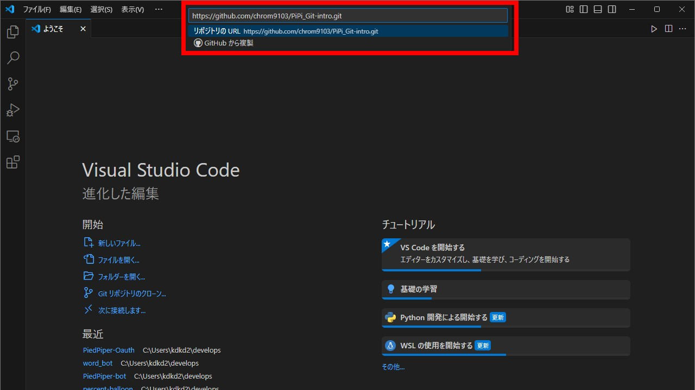
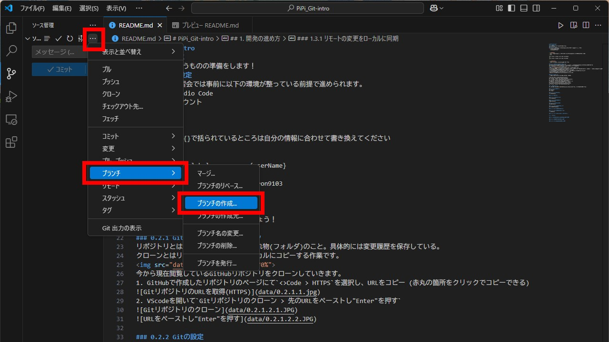
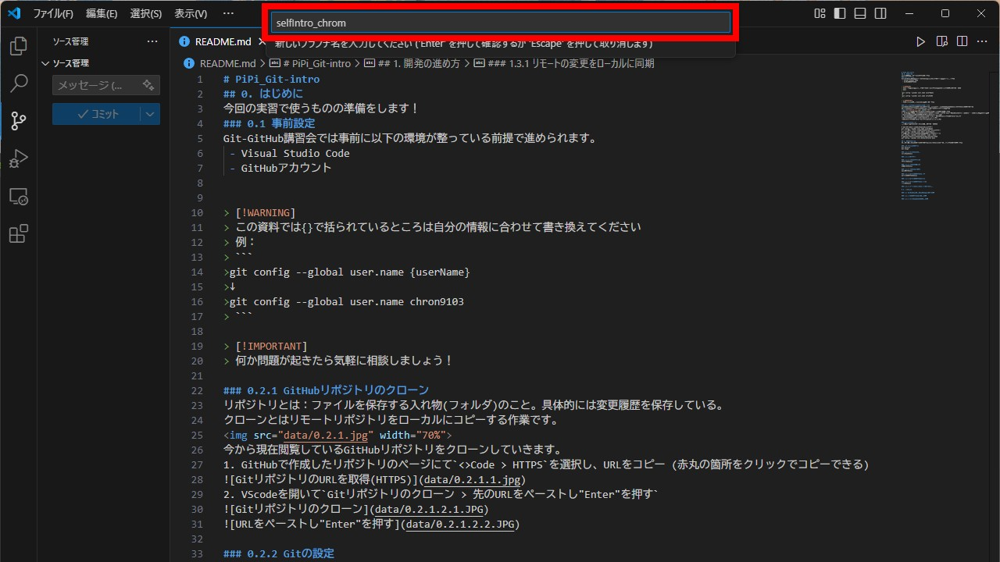
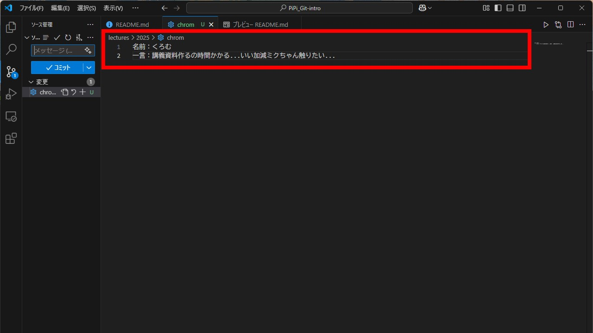
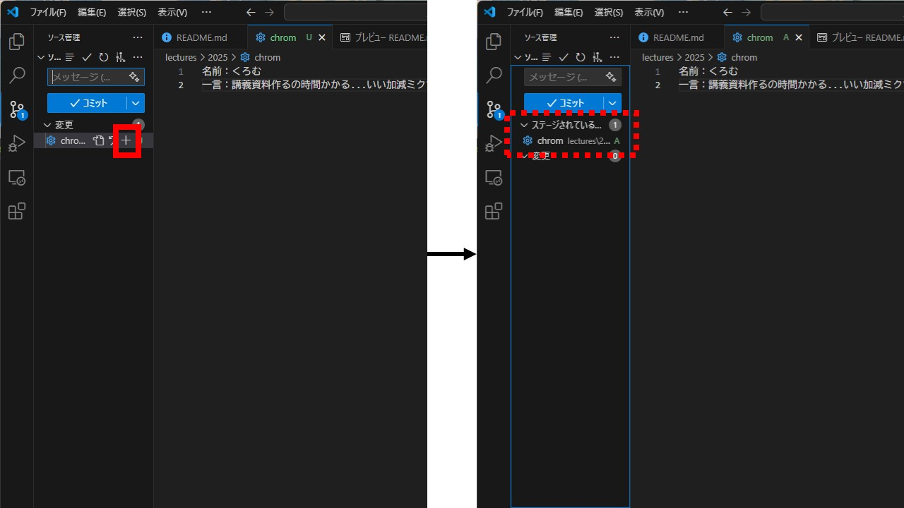
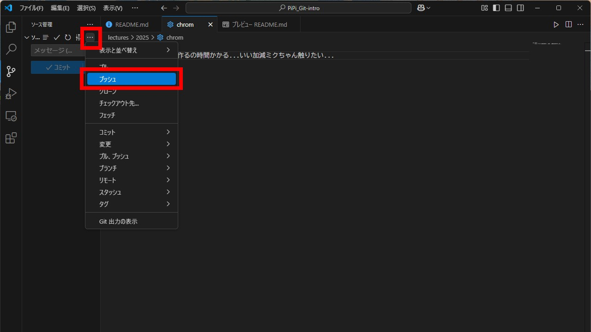
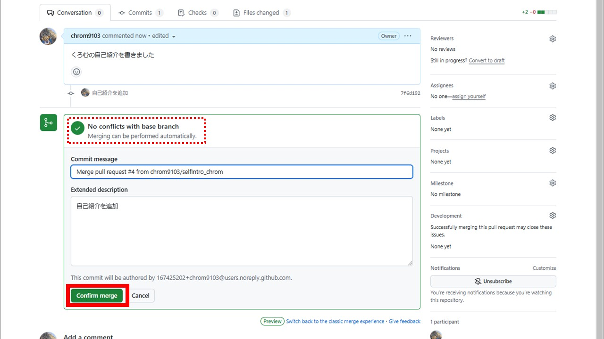
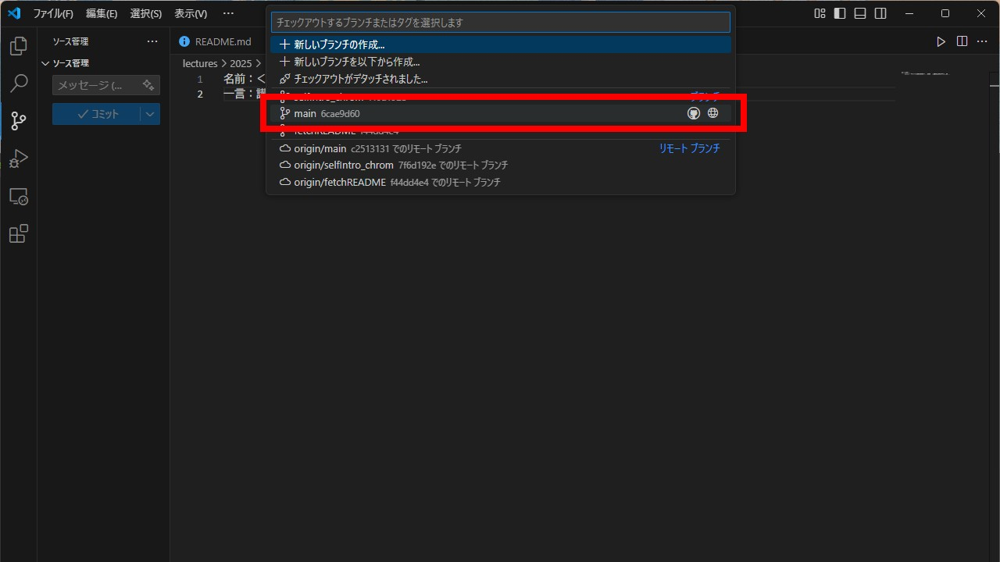
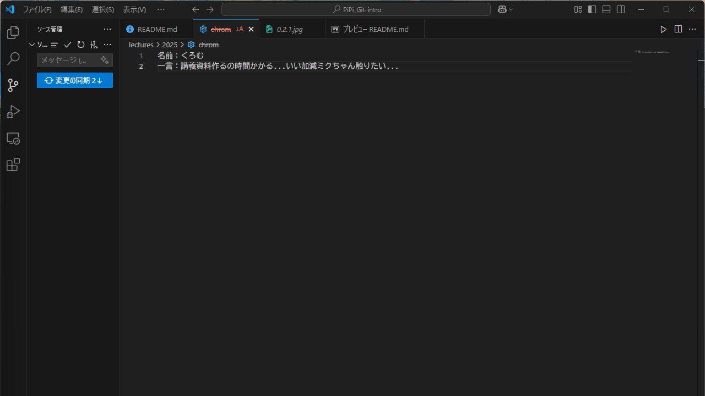
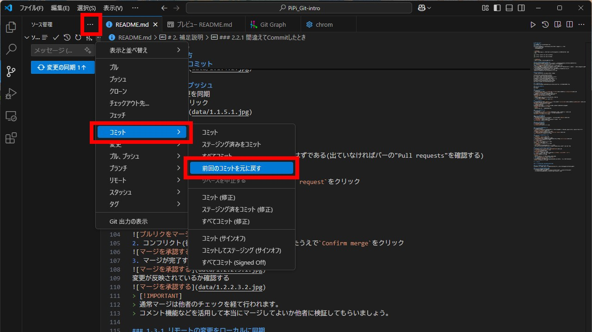

# PiPi_Git-intro

Git-GitHub講習会では、チーム開発をする上で必須となるGitHubについて基礎的な知識及び使用方法を学びます。  

## 目次

 - はじめに
    - [事前設定](#01-事前設定)
    - [GitHubリポジトリのクローン](#021-githubリポジトリのクローン)
    - [Gitの設定](#022-gitの設定)
 - 開発の進め方
    - [便利な拡張機能](#10-便利な拡張機能)
    - [ブランチの発行](#111-ブランチの発行)
    - [編集する](#112-編集する)
    - [変更をステージ](#113-変更をステージ)
    - [変更をコミット](#114-変更をコミット)
    - [変更をプッシュ](#115-変更をプッシュ)
    - [プルリクエストを出す](#121-プルリクエストを出す)
    - [プルリクエストをマージ](#122-プルリクエストをマージ)
    - [リモートの変更をローカルに同期](#131-リモートの変更をローカルに同期)
 - 用語解説
    - [ブランチ](#21-ブランチbranch)
    - [ステージ](#22-ステージstage)
    - [コミット](#23-コミットcommit)
    - [プッシュ](#24-プッシュpush)
    - [プルリクエスト](#25プルリクエストpull-request)
    - [マージ](#26-マージmerge)
    - [コンフリクト](#27-コンフリクトconflict)
    - [プル](#28-プルpull)
 - 補足説明
    - [CLIによる操作](#31-cliによる操作)
    - [間違えてcommitしたとき](#321-間違えてcommitしたとき)
    - [ブランチ名を間違えたとき](#322-ブランチ名を間違えたとき)
 - おまけ
    - [GitHubに上げたくない情報があるとき](#31-githubに上げたくない情報があるとき)


## 0. はじめに
今回の実習で使うものの準備をします！
### 0.1 事前設定
Git-GitHub講習会では事前に以下の環境が整っている前提で進められる。
 - Visual Studio Code
 - GitHubアカウント
 - Git

GitHubアカウントの作成方法については[こちら](https://docs.github.com/ja/get-started/start-your-journey/creating-an-account-on-github)を参照してください。  
GitはGitHubを活用する上で必要なシステムです。[こちら](https://git-scm.com/book/ja/v2/%E4%BD%BF%E3%81%84%E5%A7%8B%E3%82%81%E3%82%8B-Git%E3%81%AE%E3%82%A4%E3%83%B3%E3%82%B9%E3%83%88%E3%83%BC%E3%83%AB)を参考にインストールしてください。
<summary><details>Gitのインストールについて</details>

Gitのインストール時にはいくつかの設定が求められます。  
この章ではおすすめの設定のみを紹介するので各設定の意味等が気になる場合は自分で調べてください。

</summary>


> [!WARNING]
> この資料では{}で括られているところは自分の情報に合わせて書き換えてください  
> 例：
> ```
>git config --global user.name {userName}
>  ↓
>git config --global user.name chron9103
> ```

> [!IMPORTANT]
> 何か問題が起きたら気軽に相談しましょう！

### 0.2.1 GitHubリポジトリのクローン
リポジトリとは：ファイルを保存する入れ物(フォルダ)のこと。具体的には変更履歴を保存している。  
  
今から現在閲覧しているGitHubリポジトリをローカルにコピー(クローン)する。 
1. GitHubで作成したリポジトリのページにて`<>Code > HTTPS`を選択し、URLをコピー

2. VSCodeを開いて`Gitリポジトリのクローン` > 先のURLをペーストし"Enter"を押す  



### 0.2.2 Gitの設定
ターミナルで以下のコマンドを実行する。
```
# ユーザー名の設定。GitHubのIDがおすすめ
git config --global user.name {userName}
# メールアドレスの設定。GitHubと同じものがおすすめ
git config --global user.email {userEmail}
# コミットメッセージをVScodeで書けるようにする設定
git config --global core.editor 'code --wait'
# デフォルトのブランチをmasterからmainに変更。
git config --global init.defaultBranch main
```
## 1. 開発の進め方
これから実際にファイルを編集して、その変更を他の人も見れるようにしていきます！

### 1.0 便利な拡張機能
- Git Graph  
   VSCodeの拡張機能の一つである"Git Graph"の導入をお勧めします。 
     
    - 機能
      - Gitの履歴を視覚的に表示  
      - 各変更の詳細を表示  
      - ブランチの切り替え/各操作  
      etc.
ツリー上の現在位置を把握しながら操作することができ便利です。


### 1.1.1 ブランチの発行
[用語解説(ブランチ)](#21-ブランチbranch)
1. VSCodeの左部バーにある`ソース管理`から`ブランチ`をクリックして、`ブランチの作成`をクリック

2. 新しく作るブランチの名前を入力して"Enter"を押す  
ここでの名前は"selfIntro_{userName}"を推奨する

> [!NOTE]
> ウインドウ左下部に現在のブランチが表示されています。 
> 反映されていたら成功  
>  

### 1.1.2 編集する
1. VSCodeの左部バーにある`エクスプローラー`からファイル`lectures>2025`をクリックして、`新しいファイル`をクリック  
クリック後自分の名前のファイルをマークダウンで作成する（例: `chrom.md`）

2. ファイルを編集する  
VSCodeの左部バーにある`ソース管理`に変更したファイルが書いてあるはずである

> [!NOTE]
> 例に倣って名前と一言を書いてみましょう！  

### 1.1.3 変更をステージ
[用語解説(ステージ)](#22-ステージstage)
1. VSCodeの左部バーにある`ソース管理`に書いてある変更したファイルの`+`をクリック  
クリック後`ステージされている変更`に加わっていることを確認する


### 1.1.4 変更をコミット
[用語解説(コミット)](#23-コミットcommit)
1. 入力欄に変更内容(今回は"自己紹介を追加"など)を明記して`コミット`をクリック

2. `Branchの発行`をクリックしてブランチをリモートに反映する


### 1.1.5 変更をプッシュ
[用語解説(プッシュ)](#24-プッシュpush)
1. `プッシュ`をクリック  


### 1.2.1 プルリクエストを出す
[用語解説(プルリクエスト)](#25プルリクエストpull-request)
1. GitHubのリポジトリのページに次の表示が出ているはずである(出ていなければバーの"Pull requests"を確認する)  
`Compare & pull request`をクリック

2. タイトル、本文に変更内容を明記して`Create pull request`をクリック


### 1.2.2 プルリクエストをマージ
[用語解説(マージ)](#26-マージmerge)
1. `Merge pull request`をクリック

2. コンフリクト([後述](#27-コンフリクトconflict))が発生していないことを確認したうえで`Confirm merge`をクリック

3. マージが完了する

変更が反映されているか確認する

> [!IMPORTANT]
> 通常マージは他者のチェックを経て行われます。  
> コメント機能などを活用して本当にマージしてよいか他者に検証してもらいましょう。

### 1.3.1 リモートの変更をローカルに同期
1. VSCodeに戻り、`ソース管理`から`チェックアウト先`をクリック

2. `main`ブランチに切り替える

3. `変更の同期`をクリック (表示がない場合は`ソース管理 > その他の操作 > プル`)  
リモートの変更点をローカルに反映する

> [!NOTE]
> 次のような表示が出てもOKを押して続行して問題ありません。  
>  
4. 同期できていることを確認する  
現在のブランチが`main`であること(左下に表示あり)、変更点が反映されていることを確認


## 2. 用語解説

### 2.1 ブランチ(branch)
ブランチとはメインから分岐して開発をする機能である。  
メインのコードに影響を与えず、新機能の追加やバグ修正を行い、問題がなければ変更内容をメインブランチにマージ([後述](#26-マージmerge))して反映する。
 
ブランチを使うことで、複数の開発者が並行して作業できるほか特定の機能ごとに変更を管理しやすくなる。
一般的に、プログラムの修正や機能の追加を行うときなど、用途に応じたブランチを作成し、作業が完了したらメインブランチにマージする。  
各ブランチは独立しているため一つのブランチで行った変更は他のブランチには影響を与えない。そのため問題が発生しても全体に影響を及ぼさずに修整できる。

### 2.2 ステージ(stage)
ステージとは変更内容を登録することである。  
ファイルをステージすることでどの変更をコミットに含めるか選択できる。(必ずしもすべての変更をステージする必要はない)  
ステージに追加しない限り、変更はリポジトリに記録されず、他の変更と分けて管理することができる。
 

### 2.3 コミット(commit)
コミットとはステージに追加された変更をリポジトリに記録する操作である。  
コミットによりその時点のコードの状態が保存され、後で変更履歴を確認したり、特定のバージョンに戻したりできる。  
PC上にセーブポイントを登録するイメージ。コミットを行えば、後で問題が発生してもその時点の状態に戻すことができる。
  

### 2.4 プッシュ(push)
プッシュとはローカルリポジトリ(PC内)のコミットをリモートリポジトリ(オンライン)に送信し、共有する操作である。
ローカルリポジトリは自分のPC上にあるためリポジトリを他者が閲覧することはできない。そのためプッシュを行うことでローカルの変更がリモートに反映され、他のメンバーもその変更を取得できるようになる。  
プッシュをしない限りローカルの変更はリモートに影響を与えない。
  
> [!TIP]
> リモートの最新の状態と同期を取るため、プッシュ前には[プル](#28-プルpull)により最新の変更を取り込むのがよい。

### 2.5.プルリクエスト(pull request)
プルリクエストとは現在のブランチをメインブランチに[マージ](#26-マージmerge)するリクエストを出す仕組みである。  
プルリクエストを作成すると、他の開発者が変更内容を確認し、コードレビューを行うことができる。問題がなければ、承認（レビューの承認やテストの通過など）を経て、メインブランチにマージされる。
この仕組みにより、開発者は直接メインブランチを変更するのではなく、事前にチェックを受けることで品質を保ちながら安全に開発を進めることができる。
  

### 2.6 マージ(merge)
マージとは別のブランチで行った変更を現在のブランチに統合する操作である。  
  

### 2.7 コンフリクト(conflict)
コンフリクトとは同じファイルの同じ部分が異なるブランチで変更され、それらをマージしようとした際に、Git がどの変更を採用すべきか判断できない状態のことを指す。    
通常、Git は異なるブランチの変更を自動的に統合できるが、変更が重複している場合は、自動的にマージできず、手動で解決する必要がある。
コンフリクトを防ぐためには、定期的にリモートの最新変更を取り込み ([プル](#28-プルpull))、チームメンバーと作業範囲を調整することが重要である。
 

### 2.8 プル(pull)
プルとはリモートリポジトリの最新の変更をローカルリポジトリに取り込む操作である。  
実行すると、リモートリポジトリの変更を取得し、自動的に現在のブランチへ統合する。これにより、他の開発者が加えた最新の変更を自分の環境に反映できる。
プルを適切に行うことによりチーム開発においてコードの同期を保ち、コンフリクトを最小限に抑えることができる。
 

## 3. 補足説明

### 3.1 CLIによる操作
これまでVSCode上のボタン操作によりGit(GitHub)の操作を行ったが、各操作にはコマンドが用意されておりそれに対応するようにボタンが設置されている。コマンドを打ち込むことにより操作することを"CLI"と言う。
```
# gitの初期化
$ git init
# クローン
$ git clone https://github.com/hoge/fuga.git
# ブランチの発行
$ git switch -c "hogehoge"
# 変更をステージ
$ git add . 
# 変更をコミット
$ git commit -m "fugafuga"
# 変更をプッシュ
$ git push origin "hogehoge"
# リモートの変更をローカルに同期
$ git merge <commit>
```
今回紹介した以外にも多数のコマンドがあるので興味があれば各自調べるように。

### 3.2.1 間違えてCommitしたとき
プッシュを行う前であれば、`前回のコミットを元に戻す`を押すことで取り消すことができる


### 3.2.2 ブランチ名を間違えたとき
`ブランチ名の変更`で名前を変更できる
 - ブランチを削除すると削除したブランチの変更内容も消えるため、やり直す必要がある
 - ブランチの削除ができなかったら別の名前でブランチを作ればOK


## 4. おまけ

### 4.1 GitHubに上げたくない情報があるとき
Gitはデフォルトでは管理するディレクトリ以下の全てのファイルの変更を追跡する。  
しかし実際の開発ではGitに追跡されると困るもの、追跡する必要がないものがある場合がある。
このようなときにGitに無視する(追跡しない)よう指定するのが`.gitignore`である。
> [!TIP]
> `.gitignore`に入れるもの
>  - リモートに上がると困るもの
>       - 機密情報,個人情報が書かれたファイル
>  - リモートに上げる必要がないもの
>       - 依存関係のファイル(node_modulesなど)
>       - 自動生成されるファイル (追跡する場合もある)

```
# 特定のファイルを無視する
/hoge/file

# 特定のディレクトリを無視する
/hoge/directory/

# 特定の拡張子のファイルを無視する
*.txt
```
詳しくは公式テンプレート( https://github.com/github/gitignore )参照。

---
© 2025 PiedPiper青山テック愛好会


