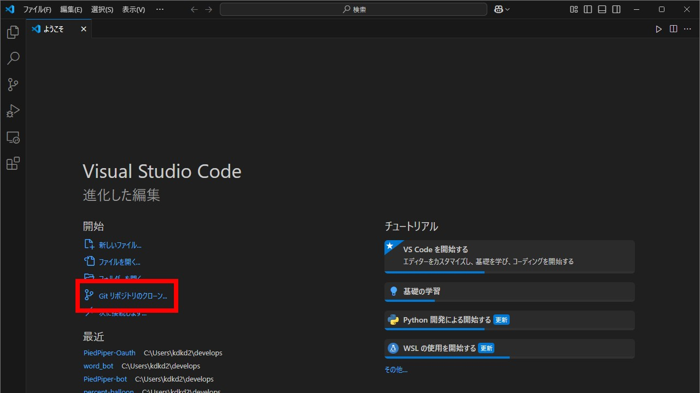

# PiPi_Git-intro
## 0. はじめに
今回の実習で使うものの準備をします！
### 0.1 事前設定
Git-GitHub講習会では事前に以下の環境が整っている前提で進められます。
 - Visual Studio Code
 - GitHubアカウント


> [!WARNING]
> この資料では{}で括られているところは自分の情報に合わせて書き換えてください  
> 例：
> ```
>git config --global user.name {userName}
>↓
>git config --global user.name chron9103
> ```

> [!IMPORTANT]
> 何か問題が起きたら気軽に相談しましょう！

### 0.2.1 GitHubリポジトリのクローン
リポジトリとは：ファイルを保存する入れ物(フォルダ)のこと。具体的には変更履歴を保存している。  
クローンとはリモートリポジトリをローカルにコピーする作業です。  
  
今から現在閲覧しているGitHubリポジトリをクローンしていきます。 
1. GitHubで作成したリポジトリのページにて`<>Code > HTTPS`を選択し、URLをコピー (赤丸の箇所をクリックでコピーできる)  

2. VScodeを開いて`Gitリポジトリのクローン > 先のURLをペーストし"Enter"を押す`  



### 0.2.2 Gitの設定
ターミナルで以下のコマンドを実行してください。
```
# ユーザー名の設定。GitHubのIDがおすすめ
git config --global user.name {userName}
# メールアドレスの設定。GitHubと同じものがおすすめ
git config --global user.email {userEmail}
# コミットメッセージをVScodeで書けるようにする設定
git config --global core.editor 'code --wait'
# デフォルトのブランチをmasterからmainに変更。
git config --global init.defaultBranch main
```
## 1. 開発の進め方
これから実際にファイルを編集して、その変更を他の人も見れるようにしていきます！

### 1.0 便利な拡張機能
Git History
Git Graph

### 1.1.1 ブランチの発行
ブランチとは：
1. VSCodeの左部バーにある`ソース管理`から`ブランチ`をクリックして、`ブランチの作成`をクリック

2. 新しく作るブランチの名前を入力して"Enter"を押す  
ここでの名前は"selfIntro_{username}"を推奨する

> [!NOTE]
> ウインドウ左下部に現在のブランチが表示されている。  
> 反映されていたら成功。  
>  

### 1.1.2 編集する

### 1.1.3 変更をステージ
ステージとは：

### 1.1.4 変更をコミット
コミットとは：

### 1.1.5 変更をプッシュ
プッシュとは：

### 1.2.1 プルリクエストを出す
プルリクエストとは：

### 1.2.2 プルリクエストを精査

### 1.2.3 プルリクエストをマージ
マージとは：

### 1.3.1 リモートの変更をローカルに同期

# 2. 補足説明

### 2.1 GitHubに上げたくない情報があるとき

### 2.2.1 間違えてCommitしたとき

### 2.2.2 ブランチ名を間違えたとき
